# PodFinder ReactJS and REST API Container Web App

This app was created and bootstrapped by ReactJS using ReactJSv18.2.0 and React Routerv6.14.1. Please refer to /api to see the ExpressJS/Postgres REST API to server API calls made here.

## Frameworks and Libraries Used on Frontend (/src):

- ReactJS v18.2.0 with ES6 Arrow Function Client Components (see /Components), Custom Hooks (see /tshooks) and Standard React Hooks (useState, useEffect, useCallback, useMemo, useContext). As well as Custom Context Providers.
- ReactRouter v6.4.1 for distinct routing, see the BrowserRouter configuration defined in /src/App.tsx
- TypeScript (Interfaces/Types/Unions) for props, response from REST API and in use for function signatures, Component props.  
- MaterialUI V5 with sx prop styling.
- Axios
- CSS Component Stylesheets (Flexbox and Grid).
- Icons8 for Static Assets

For the REST API (/api) refer to /src for the individual routers: such as elephantsql.ts to server any user-related (auth/likes) as well as podcast-processing endpoints, and smtp.ts for any automated email endpoints for 2FA. Refer to the package.json file in this folder to see how to run the individual Express app routers.

## Frameworks and Libraries Used on API:

- NodeJS
- ExpressJS
- PostgreSQL (ElephantSQL)
- Typescript
- Axios
- BCrypt
- Cors
- NodeMailer/SMTP Server

## Here are some screenshots from the web app:

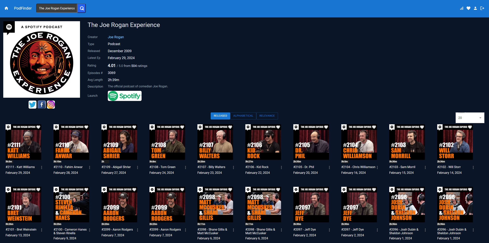

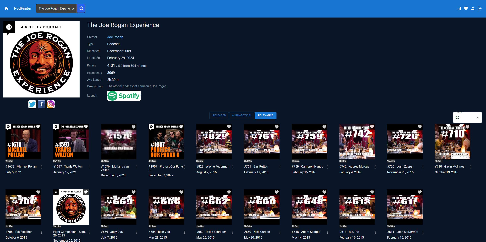

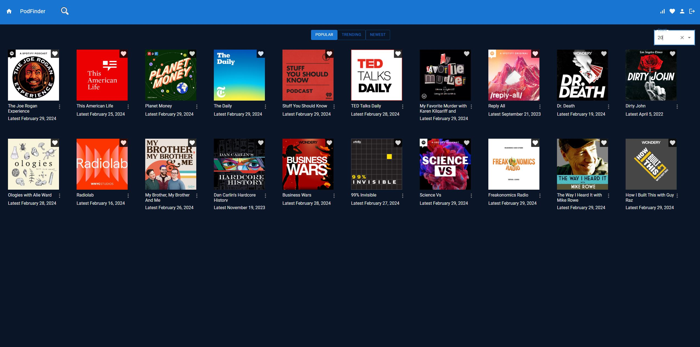

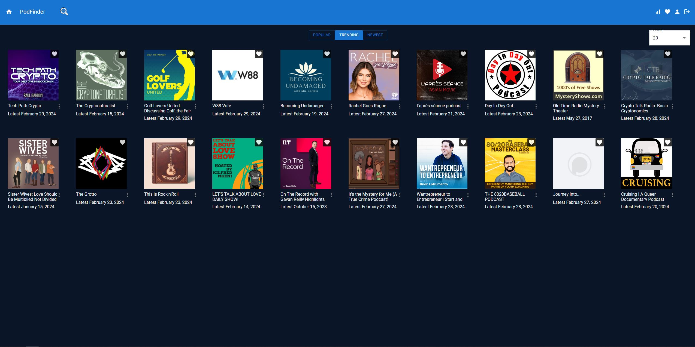

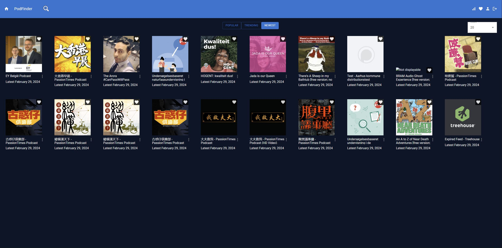

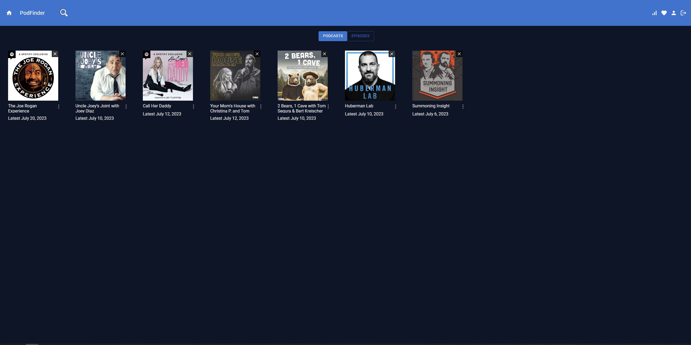

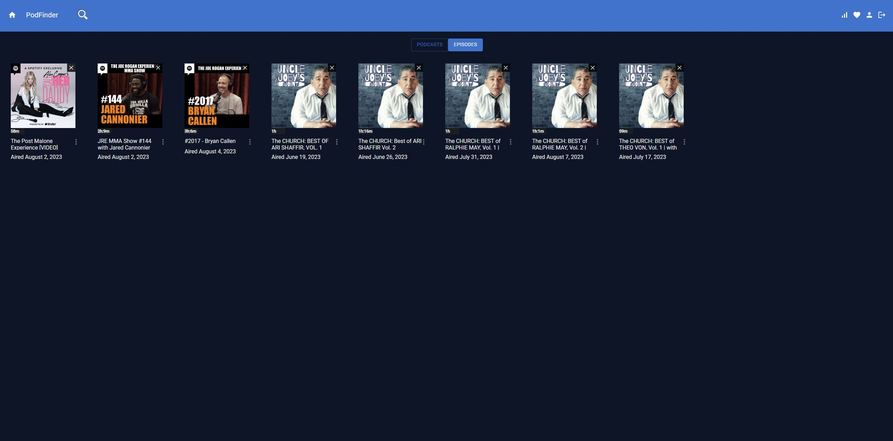

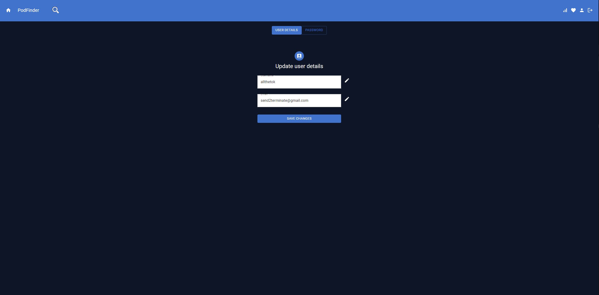

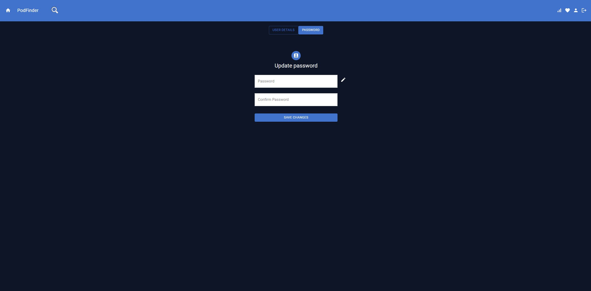

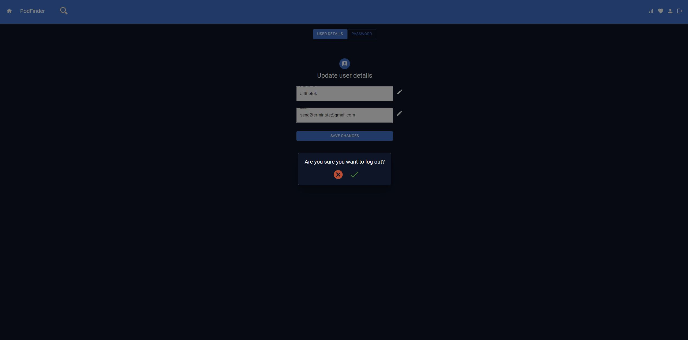

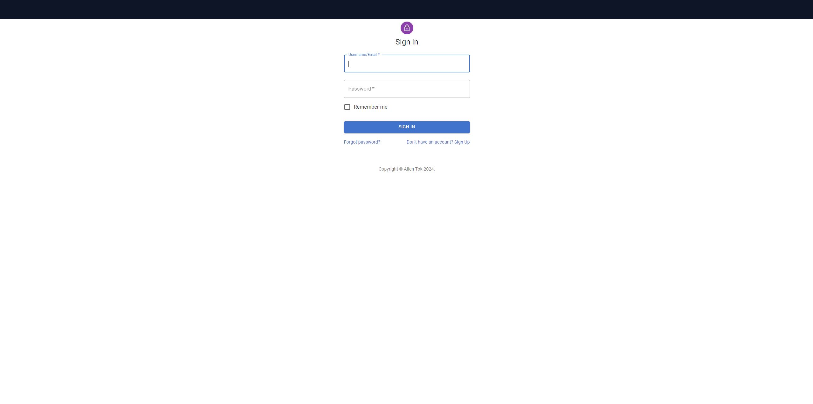

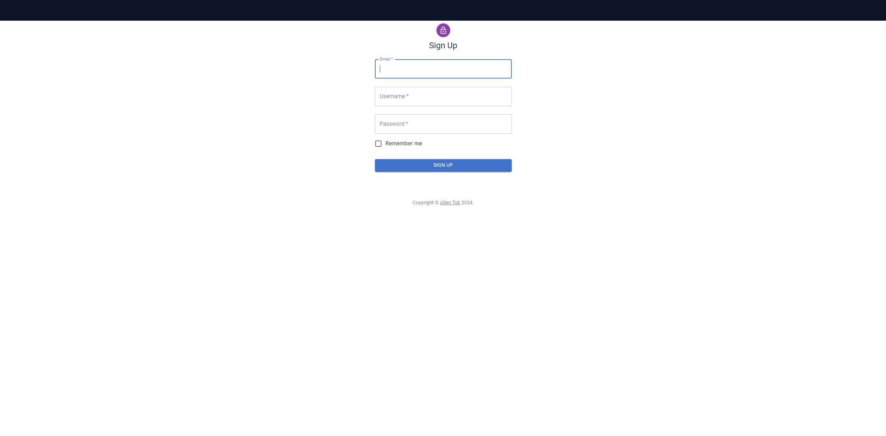

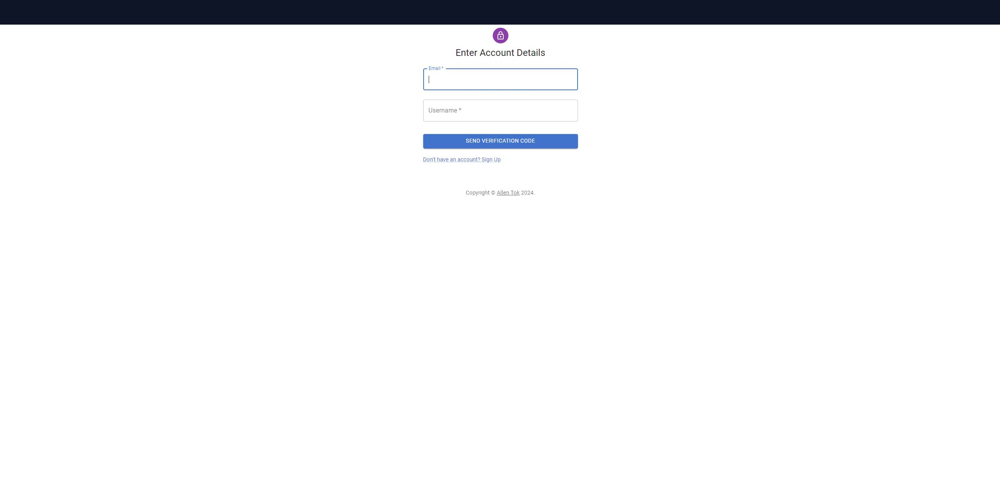

